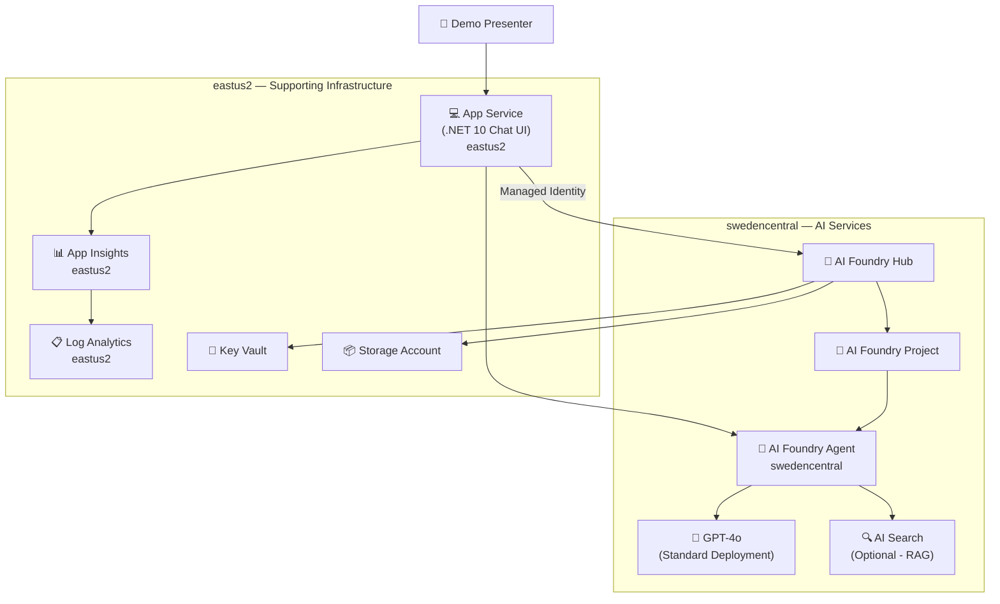

# 🏛️ Step 2: Architecture Assessment - Foundry Healthcare Agents

📑 Assessment Contents

- [✅ Requirements Validation](#-requirements-validation)
- [💎 Executive Summary](#-executive-summary)
- [📦 Resource SKU Recommendations](#-resource-sku-recommendations)
- [🎯 Architecture Decision Summary](#-architecture-decision-summary)
- [🔒 Security Posture](#-security-posture)
- [💰 Cost Estimates](#-cost-estimates)
- [🌐 Region Placement Strategy](#-region-placement-strategy)
- [🔗 Connectivity Patterns](#-connectivity-patterns)
- [🚀 Implementation Handoff](#-implementation-handoff)
- [References](#references)

---

## ✅ Requirements Validation

| Category | Required | Status | Notes |
| -------- | -------- | ------ | ----- |
| Scope | AI Foundry Hub + Project, OpenAI GPT-4o, supporting infra, web app | ✅ Defined | Healthcare AI agent demo |
| Scale | 1–10 daily users, 1–5 concurrent | ✅ Defined | Demo/PoC workload |
| Region | swedencentral (AI), eastus2 (infra) | ✅ Defined | Dual-region strategy |
| Budget | ~$100–300/month | ✅ Defined | Smallest viable SKUs |
| Security | Managed Identity, RBAC, no keys, TLS 1.2 | ✅ Defined | Public endpoints acceptable |

All prerequisites confirmed — proceeding with assessment.

---

## 💎 Executive Summary

This architecture deploys an **Azure AI Foundry Hub + Project** in swedencentral with a GPT-4o model deployment for healthcare agent reasoning. A **.NET 10 sample web app** (chat UI) is hosted on **Azure App Service** in eastus2 and communicates with the AI Foundry agent endpoint using Managed Identity. Supporting infrastructure (Storage, Key Vault, Log Analytics, Application Insights) is colocated in eastus2 for cost efficiency.

The design prioritizes **simplicity and cost-effectiveness** for demo/PoC use — public endpoints, minimal SKUs, no VNet complexity.

### Recommended Architecture



---

## 📦 Resource SKU Recommendations

| Service | Recommended SKU | Region | Configuration | Est. Monthly Cost |
| ------- | --------------- | ------ | ------------- | ----------------- |
| Azure AI Foundry Hub | Basic | swedencentral | System-assigned managed identity | Included (no separate charge) |
| Azure AI Foundry Project | — | swedencentral | Connected to Hub | Included |
| Azure OpenAI (GPT-4o) | S0 / Standard deployment | swedencentral | 1K TPM capacity, `2024-11-20` version | ~$0–15 (pay-per-token) |
| Storage Account | Standard_LRS | eastus2 | Blob + Table, HTTPS only, no public blob access | ~$1–5 |
| Key Vault | Standard | eastus2 | RBAC authorization, purge protection enabled | ~$0.03/operation |
| Log Analytics Workspace | PerGB2018 | eastus2 | 5 GB daily cap, 30-day retention | ~$5–10 |
| Application Insights | Workspace-based | eastus2 | Connected to Log Analytics | Included with LAW |
| App Service Plan | B1 (Basic) | eastus2 | Linux, 1 instance, .NET 10 | ~$13/month |
| App Service | — | eastus2 | .NET 10, system-assigned identity | Included with plan |
| AI Search (optional) | Free (F) | swedencentral | 50 MB storage, 3 indexes | $0 (Free tier) |

**Estimated Total: ~$35–50/month** (well within $100–300 budget, with pay-per-token OpenAI usage scaling based on demo activity)

---

## 🎯 Architecture Decision Summary

| Decision | Choice | Rationale |
| -------- | ------ | --------- |
| AI platform | Azure AI Foundry (Hub + Project) | Native agent framework, portal playground, built-in evaluation tools |
| Model hosting | GPT-4o Standard deployment | Best reasoning capability for healthcare triage; Standard SKU is pay-per-token with no upfront cost |
| Web app hosting | App Service (B1 Linux) | Simpler deployment model than Container Apps; azd native support; sufficient for demo traffic |
| Observability | App Insights + Log Analytics | Workspace-based App Insights provides unified telemetry with agent tracing |
| Secrets management | Key Vault with RBAC | No access policies; system-assigned MI for all consumers |
| Knowledge base (optional) | AI Search Free tier | Enables RAG pattern demo without cost; can be omitted if not needed |
| IaC approach | AVM pattern module `br/public:avm/ptn/ai-ml/ai-foundry` | Single AVM module deploys Hub + Project + dependencies; reduces Bicep complexity |
| Authentication | Managed Identity throughout | Zero stored credentials; RBAC role assignments for service-to-service access |

### Trade-offs: App Service vs Container Apps

| Factor | App Service (B1) | Container Apps (Consumption) |
| ------ | ---------------- | ---------------------------- |
| Cost (idle) | ~$13/month fixed | $0 when idle (scale to zero) |
| Deployment simplicity | ✅ Simple — `az webapp deploy` or azd | Requires container build + registry |
| Cold start | None (always running) | ~2–5s on first request after idle |
| .NET 10 support | ✅ Native runtime | Requires Dockerfile |
| azd integration | ✅ Mature, well-documented | Supported but more config |
| Demo experience | ✅ Instant response | May show cold start lag |

**Decision**: App Service B1 — for a demo where instant responsiveness matters and the fixed cost is negligible within budget. No container registry overhead.

---

## 🔒 Security Posture

| Control | Implementation | Scope |
| ------- | -------------- | ----- |
| Managed Identity | System-assigned on App Service, AI Foundry Hub | All service-to-service auth |
| RBAC | `Cognitive Services OpenAI User` for App Service MI on AI Services | Least-privilege model access |
| Key Vault RBAC | `Key Vault Secrets User` for App Service MI | No vault access policies |
| No API keys in code | All connections via MI + DefaultAzureCredential | Zero secrets in config |
| TLS 1.2 minimum | Enforced on all services | Transport security |
| Storage security | HTTPS only, no public blob access | Data at rest/transit |
| Public endpoints | Acceptable for demo | No private endpoints needed |
| Encryption at rest | Platform-managed keys (Microsoft-managed) | All data services |

### RBAC Role Assignments

| Principal | Role | Scope |
| --------- | ---- | ----- |
| App Service MI | `Cognitive Services OpenAI User` | AI Foundry / AI Services resource |
| App Service MI | `Key Vault Secrets User` | Key Vault |
| App Service MI | `Storage Blob Data Reader` | Storage Account |
| AI Foundry Hub MI | `Key Vault Secrets User` | Key Vault |
| AI Foundry Hub MI | `Storage Blob Data Contributor` | Storage Account |

---

## 💰 Cost Estimates

| Component | Monthly Est. | Notes |
| --------- | ------------ | ----- |
| Azure OpenAI GPT-4o | $0–30 | Pay-per-token; ~$0.005/1K input tokens; demo usage is minimal |
| App Service B1 | $13 | Fixed — always running |
| Storage Account (LRS) | $1–3 | Minimal blob storage for AI Foundry |
| Log Analytics | $5–10 | 5 GB/day cap; demo generates minimal logs |
| Key Vault | <$1 | Minimal operations |
| AI Search Free | $0 | Free tier (optional) |
| **Total** | **~$20–60/month** | Well under $300 budget |

> OpenAI costs are usage-based. During active demo sessions with multiple attendees, expect 10K–50K tokens/session → $0.05–$0.25/session.

---

## 🌐 Region Placement Strategy

| Region | Resources | Justification |
| ------ | --------- | ------------- |
| **swedencentral** | AI Foundry Hub, AI Foundry Project, Azure OpenAI (GPT-4o), AI Search (optional) | GPT-4o model availability; EU data residency |
| **eastus2** | App Service, Storage Account, Key Vault, Log Analytics, App Insights | Primary Azure region; lower latency for supporting infra; cost-effective |

### Cross-region Latency

App Service (eastus2) → AI Foundry Agent (swedencentral): ~80–120ms round-trip. Acceptable for conversational AI where users expect 1–3s response times from LLM inference.

---

## 🔗 Connectivity Patterns

```text
┌─────────────────────────────────────────────────────────┐
│  eastus2                                                 │
│                                                          │
│  App Service (.NET 10)                                   │
│    ├── HTTPS → AI Foundry Agent endpoint (swedencentral) │
│    ├── MI → Key Vault (RBAC)                             │
│    └── SDK → App Insights (connection string)            │
│                                                          │
│  Storage Account ←── MI ── AI Foundry Hub                │
│  Key Vault ←── MI ── AI Foundry Hub                      │
│  Log Analytics ← App Insights                            │
└─────────────────────────────────────────────────────────┘

┌─────────────────────────────────────────────────────────┐
│  swedencentral                                           │
│                                                          │
│  AI Foundry Hub                                          │
│    └── AI Foundry Project                                │
│          └── Agent (GPT-4o)                              │
│                └── (Optional) AI Search for RAG          │
└─────────────────────────────────────────────────────────┘
```

All connections use **public endpoints over HTTPS** with **Managed Identity authentication** (no API keys).

---

## 🚀 Implementation Handoff

### Ready for bicep-plan

The architecture is ready for implementation with the following key parameters:

| Parameter | Value |
| --------- | ----- |
| Primary AI Region | swedencentral |
| Supporting Region | eastus2 |
| Environment | Dev (demo/PoC) |
| Resource Count | 9 (including optional AI Search) |
| IaC Approach | AVM pattern module + individual AVM resources |

### Resources to Provision

| # | Resource | SKU | Key Config |
| --- | --- | --- | --- |
| 1 | AI Foundry Hub | Basic | swedencentral, system MI, linked to KV + Storage |
| 2 | AI Foundry Project | — | Connected to Hub |
| 3 | Azure OpenAI (GPT-4o) | S0 Standard, 1K TPM | swedencentral, model version `2024-11-20` |
| 4 | Storage Account | Standard_LRS | eastus2, HTTPS only, no public blob |
| 5 | Key Vault | Standard | eastus2, RBAC auth, purge protection |
| 6 | Log Analytics Workspace | PerGB2018 | eastus2, 30-day retention |
| 7 | Application Insights | Workspace-based | eastus2, linked to LAW |
| 8 | App Service Plan + App | B1 Linux | eastus2, .NET 10, system MI |
| 9 | AI Search (optional) | Free (F) | swedencentral, 3 indexes max |

### AVM Modules to Use

| Resource | AVM Module |
| -------- | ---------- |
| AI Foundry (Hub + Project + OpenAI) | `br/public:avm/ptn/ai-ml/ai-foundry` |
| Key Vault | `br/public:avm/res/key-vault/vault` |
| Storage Account | `br/public:avm/res/storage/storage-account` |
| Log Analytics | `br/public:avm/res/operational-insights/workspace` |
| App Insights | `br/public:avm/res/insights/component` |
| App Service Plan | `br/public:avm/res/web/serverfarm` |
| App Service | `br/public:avm/res/web/site` |
| AI Search | `br/public:avm/res/search/search-service` |

### Data Endpoint

The sample healthcare web app communicates with the **AI Foundry Agent endpoint** (swedencentral) for conversational AI. No persistent data store is required for the web app itself — the agent handles conversation state. Seed data for healthcare scenarios (symptoms, medications, appointments) will be embedded as **local JSON files** in the .NET app, since no dedicated database is provisioned.

---

## References

- [Microsoft Foundry Bicep Quickstart](https://learn.microsoft.com/azure/foundry/how-to/create-resource-template)
- [AVM AI Foundry Pattern Module](https://github.com/Azure/bicep-registry-modules/tree/main/avm/ptn/ai-ml/ai-foundry)
- [Azure OpenAI Model Deployment](https://learn.microsoft.com/azure/foundry/foundry-models/how-to/create-model-deployments)
- [App Service Linux Pricing](https://azure.microsoft.com/pricing/details/app-service/linux/)
- [Azure AI Search Free Tier](https://learn.microsoft.com/azure/search/search-sku-tier)
