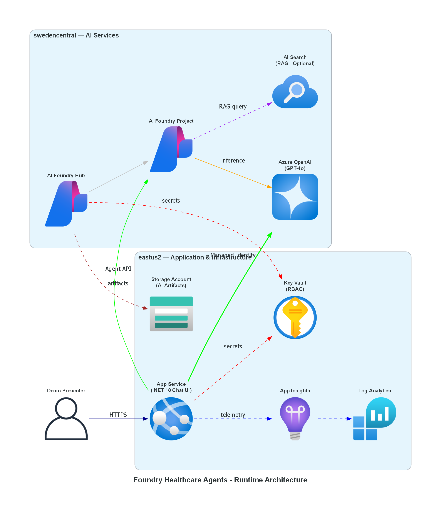

<!-- markdownlint-disable MD033 MD041 -->

<div>

# 🏗️ foundry-healthcare-agents

**Healthcare-focused AI agent demo deploying Azure AI Foundry Hub, Project, and supporting infrastructure for training and demonstration purposes. Showcases patient triage, appointment scheduling, clinical Q&A, and medication info agents.**

💪 This template scenario is part of the larger [Microsoft Trainer Demo Deploy Catalog](https://aka.ms/trainer-demo-deploy).

</div>

---

## ⬇️ Installation

[Azure Developer CLI - AZD](https://learn.microsoft.com/en-us/azure/developer/azure-developer-cli/install-azd)
When installing AZD, the following tools will be installed on your machine as well, if not already installed:

- [GitHub CLI](https://cli.github.com/)
- [Bicep CLI](https://learn.microsoft.com/en-us/azure/azure-resource-manager/bicep/install)

You need Owner or Contributor access permissions to an Azure Subscription to deploy the scenario.

## 🚀 Deploying the scenario in 4 steps

1. Create a new folder on your machine.

```shell
mkdir foundry-healthcare-agents
```

2. Next, navigate to the new folder.

```shell
cd foundry-healthcare-agents
```

3. Next, run azd init to initialize the deployment.

```shell
azd init -t petender/foundry-healthcare-agents
```

4. Last, run azd up to trigger an actual deployment.

```shell
azd up
```

⏩ Note: you can delete the deployed scenario from the Azure Portal, or by running `azd down` from within the initiated folder.

## What is the demo scenario about?

This demo deploys an Azure AI Foundry environment configured for healthcare AI agent scenarios. It provisions an AI Foundry Hub and Project in swedencentral with a GPT-4o model deployment, plus supporting infrastructure (Storage, Key Vault, Application Insights, Log Analytics) in eastus2. The agents are configured for healthcare use cases including patient triage, appointment scheduling, clinical Q&A, and medication information — all using synthetic data for safe demonstration.

## 📋 Project Summary

| Property              | Value                                          |
| --------------------- | ---------------------------------------------- |
| **Created**           | 2025-07-16                                     |
| **Last Updated**      | 2025-07-16                                     |
| **Region**            | swedencentral (AI), eastus2 (compute)          |
| **Resource Group**    | `rg-foundry-healthcare-agents`                 |
| **Web App URL**       | https://app-fha-dev-qp5yn2.azurewebsites.net/  |
| **Status**            | ✅ Deployed                                    |

---

## 🏛️ Architecture



### Deployed Resources

| Resource               | Name                    | Region         |
| ---------------------- | ----------------------- | -------------- |
| AI Foundry Hub         | `hub-fha-dev-qp5yn2`   | swedencentral  |
| AI Foundry Project     | `proj-fha-dev-qp5yn2`  | swedencentral  |
| Azure OpenAI (GPT-4o) | `oai-fha-dev-qp5yn2`   | swedencentral  |
| AI Search              | `srch-fha-dev-qp5yn2`  | swedencentral  |
| App Service            | `app-fha-dev-qp5yn2`   | eastus2        |
| App Service Plan       | `asp-fha-dev`           | eastus2        |
| Key Vault              | `kv-fha-dev-qp5yn2`    | eastus2        |
| Storage Account        | `stfhadevqp5yn2`       | eastus2        |
| Log Analytics          | `log-fha-dev-qp5yn2`   | eastus2        |
| Application Insights   | `appi-fha-dev-qp5yn2`  | eastus2        |

---

## 📊 Progress

| Step | Agent        | Status      | Artifact                         |
| ---- | ------------ | ----------- | -------------------------------- |
| 1    | Requirements | ✅ Complete | `01-requirements.md`             |
| 2    | Architect    | ✅ Complete | `02-architecture-assessment.md`  |
| 3    | Bicep        | ✅ Complete | `infra/`, `04-runtime-diagram.png` |
| 3b   | Development  | ✅ Complete | `src/FoundryHealthcareAgents.Web/` |
| 4    | Deploy       | ✅ Complete | Deployed to Azure                |
| 5    | DemoGuide    | ⏳ Pending  | `demoguide/demoguide.md`         |
