## Demo Guide - foundry-healthcare-agents

> Generated by az-07-DemoGuide on 2026-05-16.
> Audience: Trainers, presales engineers, technical evangelists.
> Format: Technical walkthrough (30 minutes).

## Overview

This demo shows a deployed healthcare AI solution using Azure AI Foundry Hub and Project,
Azure OpenAI GPT-4o, and a .NET 10 web app with four healthcare agents.

The live demo emphasizes:

- Azure resource architecture in the portal
- AI Foundry Hub/Project and model deployment
- Multi-agent healthcare chat experiences in the web app
- Observability with Application Insights and Log Analytics

## Scenario Snapshot

| Item | Value |
| --- | --- |
| Subscription | 498ab842-278f-45f8-ac5c-dc89061565cd |
| Resource group | rg-foundry-healthcare-agents |
| Web app URL | https://app-fha-dev-qp5yn2.azurewebsites.net/ |
| AI Foundry Hub | hub-fha-dev-qp5yn2 (swedencentral) |
| AI Foundry Project | proj-fha-dev-qp5yn2 (swedencentral) |
| Azure OpenAI | oai-fha-dev-qp5yn2 with gpt-4o (2024-11-20) |
| AI Search | srch-fha-dev-qp5yn2 |
| App Service | app-fha-dev-qp5yn2 (eastus2, Linux) |
| Key Vault | kv-fha-dev-qp5yn2 |
| Storage account | stfhadevqp5yn2 |
| Log Analytics | log-fha-dev-qp5yn2 |
| Application Insights | appi-fha-dev-qp5yn2 |

## Screenshot Capture Status

> [!WARNING]
> Playwright screenshot capture was not available in this environment.
> This guide uses manual screenshot placeholders and a required capture checklist.
> Capture and save screenshots into `demoguide/images/` before final delivery.

## Prerequisites

- Azure CLI installed and logged in (`az login`)
- Azure Developer CLI installed (`azd version`)
- Access to subscription `498ab842-278f-45f8-ac5c-dc89061565cd`
- At least `Contributor` on `rg-foundry-healthcare-agents`
- Browser access to Azure Portal and the deployed web app
- Permission to view AI Foundry, Azure OpenAI, App Service, and monitoring resources

## Pre-demo Checklist (Validated)

Validation timestamp: 2026-05-16

| Check | Command | Status | Evidence |
| --- | --- | --- | --- |
| Resource group exists | `az group show --name rg-foundry-healthcare-agents --subscription 498ab842-278f-45f8-ac5c-dc89061565cd --output table` | PASS | ProvisioningState = Succeeded |
| Resource inventory healthy | `az resource list --resource-group rg-foundry-healthcare-agents --subscription 498ab842-278f-45f8-ac5c-dc89061565cd --output table` | PASS | Core resources show Status = Succeeded |
| App Service running | `az webapp show --name app-fha-dev-qp5yn2 --resource-group rg-foundry-healthcare-agents --subscription 498ab842-278f-45f8-ac5c-dc89061565cd --query "{state:state,httpsOnly:httpsOnly}" --output table` | PASS | State = Running, HttpsOnly = True |
| Web endpoint reachable | `Invoke-WebRequest https://app-fha-dev-qp5yn2.azurewebsites.net/` | PASS | HTTP 200 |
| Azure OpenAI account ready | `az cognitiveservices account show --name oai-fha-dev-qp5yn2 --resource-group rg-foundry-healthcare-agents --subscription 498ab842-278f-45f8-ac5c-dc89061565cd --output table` | PASS | ProvisioningState = Succeeded |
| GPT deployment exists | `az cognitiveservices account deployment list --name oai-fha-dev-qp5yn2 --resource-group rg-foundry-healthcare-agents --subscription 498ab842-278f-45f8-ac5c-dc89061565cd --output table` | PASS | gpt-4o, State = Succeeded |
| App Insights provisioned | `az monitor app-insights component show --app appi-fha-dev-qp5yn2 --resource-group rg-foundry-healthcare-agents --subscription 498ab842-278f-45f8-ac5c-dc89061565cd --output table` | PASS | ProvisioningState = Succeeded |

## Demo Setup (If Not Already Deployed)

From `generated-scenarios/foundry-healthcare-agents`:

```powershell
azd auth login
azd up --no-prompt
```

For code-only updates after infra already exists:

```powershell
azd deploy --no-prompt
```

Verify deployment outputs:

```powershell
az deployment group show `
  --resource-group rg-foundry-healthcare-agents `
  --subscription 498ab842-278f-45f8-ac5c-dc89061565cd `
  --name foundry-healthcare-agents-1778972749 `
  --query properties.outputs
```

## Demo Script (Technical, 30 minutes)

### 1. Architecture Context in Azure Portal (5 minutes)

What to show:

1. Open Resource Group Overview:
   https://portal.azure.com/#@/resource/subscriptions/498ab842-278f-45f8-ac5c-dc89061565cd/resourceGroups/rg-foundry-healthcare-agents/overview
2. Show resource list and dual-region placement:
   swedencentral (AI services) and eastus2 (app/ops services).
3. Open Deployments and show `foundry-healthcare-agents-1778972749` success.

What to say:

- This solution separates AI services from app hosting while staying simple for demos.
- Managed identity is used to avoid embedded API keys in application code.

Expected result:

- Audience sees complete deployed architecture and successful deployment state.

If it fails:

- Run `az resource list --resource-group rg-foundry-healthcare-agents --output table`.
- If resources are missing, run `azd up --no-prompt`.

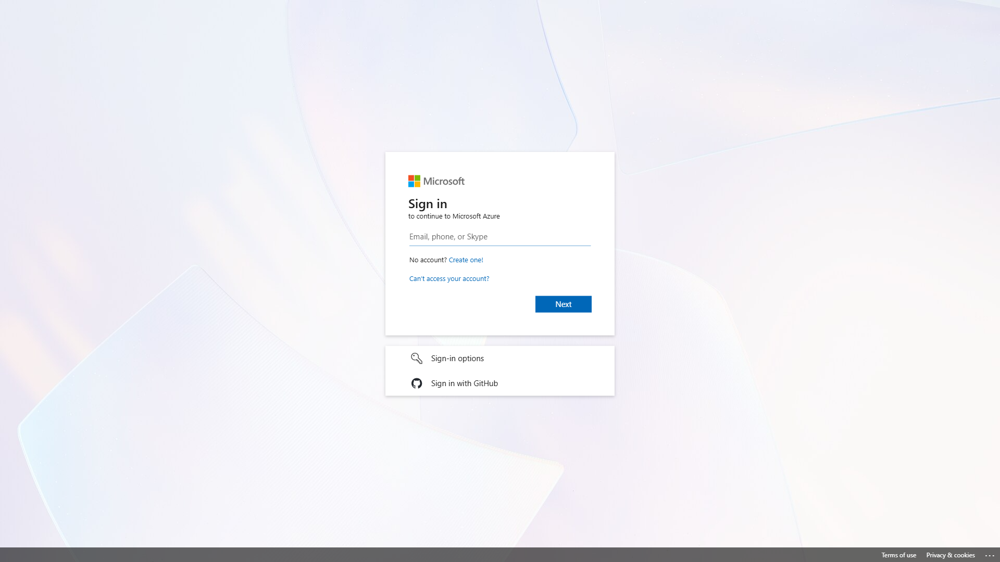
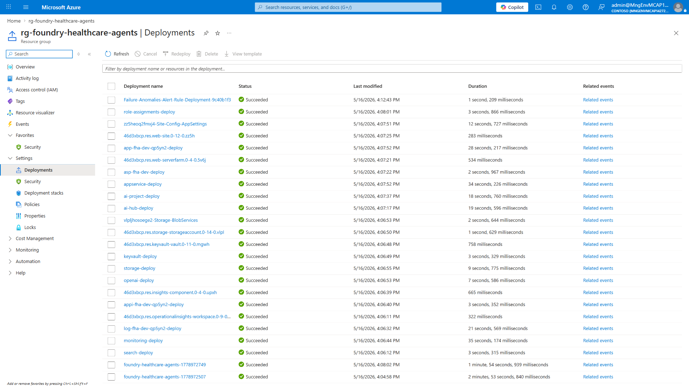

### 2. AI Foundry Hub and Project Deep-dive (6 minutes)

What to show:

1. Open Hub `hub-fha-dev-qp5yn2` overview.
2. Open Project `proj-fha-dev-qp5yn2` overview.
3. In Azure OpenAI `oai-fha-dev-qp5yn2`, open model deployments and show `gpt-4o`.
4. Open AI Search `srch-fha-dev-qp5yn2` overview to discuss optional RAG extension.

What to say:

- Hub and Project separate governance from solution implementation.
- GPT-4o provides high-quality, conversational healthcare responses in this demo.
- AI Search can be wired to enterprise knowledge for retrieval-augmented workflows.

Expected result:

- Audience understands Foundry assets and model dependency.

If it fails:

- Validate deployment: `az cognitiveservices account deployment list --name oai-fha-dev-qp5yn2 --resource-group rg-foundry-healthcare-agents --output table`.
- If not found, redeploy infra with `azd up --no-prompt`.


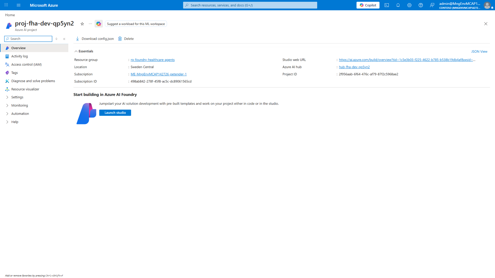
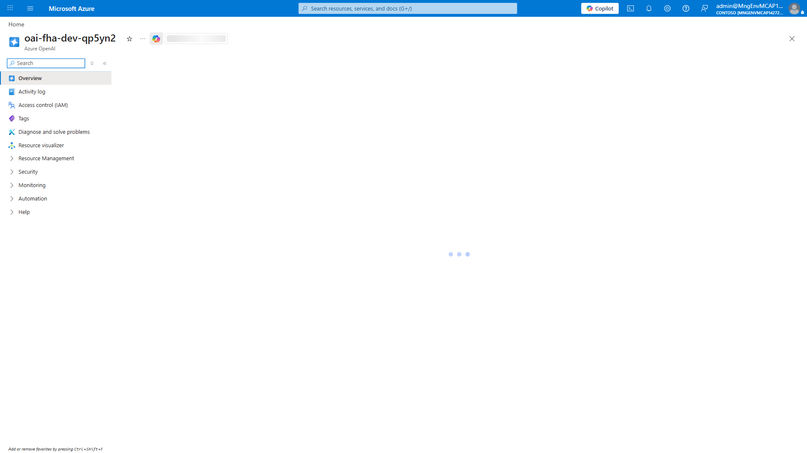
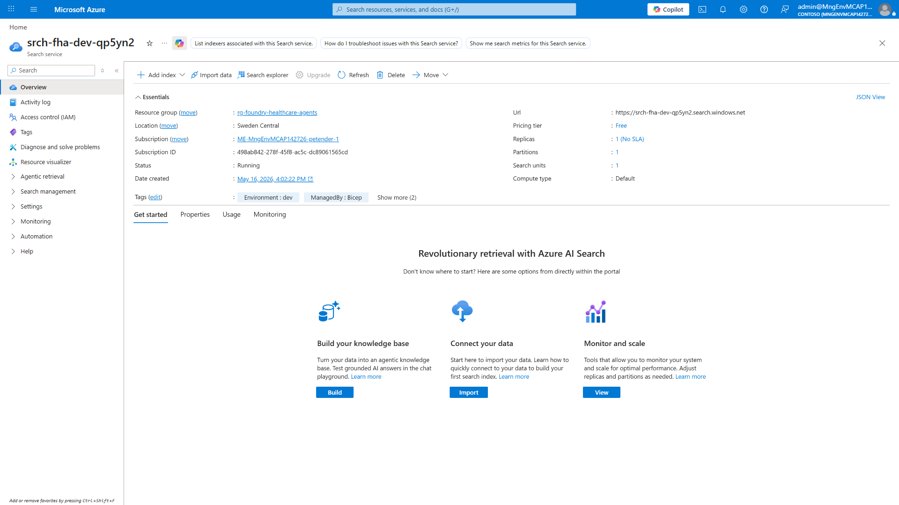

### 3. App Service and Identity Configuration (4 minutes)

What to show:

1. Open App Service `app-fha-dev-qp5yn2` overview and URL.
2. Open Configuration and highlight application settings for OpenAI endpoint.
3. Open Identity blade and show system-assigned managed identity is enabled.

What to say:

- App Service hosts a .NET 10 Razor app with four agent personas.
- The app authenticates to Azure OpenAI using `DefaultAzureCredential` and managed identity.

Expected result:

- Audience sees secure app-to-AI authentication posture.

If it fails:

- Check app state: `az webapp show --name app-fha-dev-qp5yn2 --resource-group rg-foundry-healthcare-agents --query state -o tsv`.
- Start app if needed: `az webapp start --name app-fha-dev-qp5yn2 --resource-group rg-foundry-healthcare-agents`.

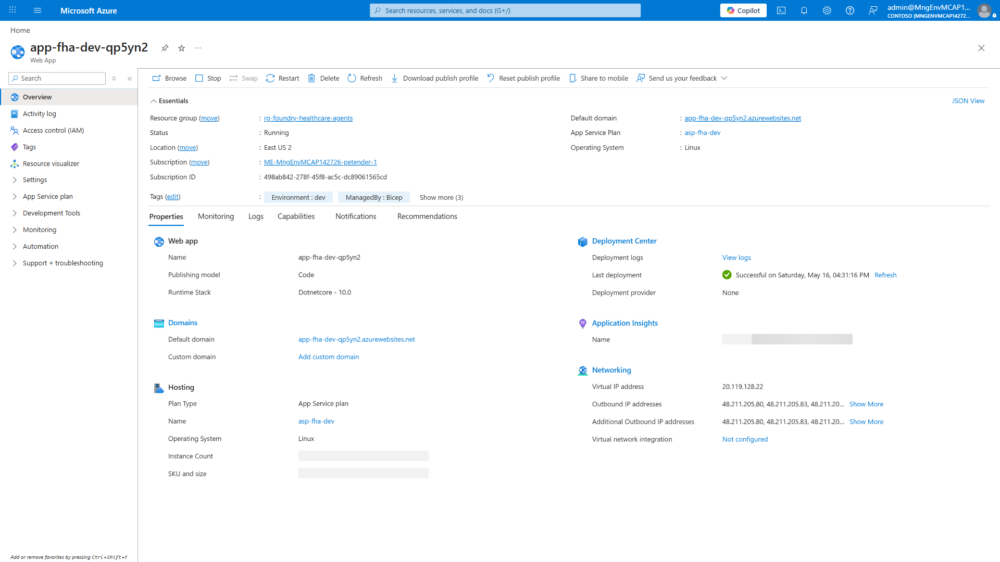

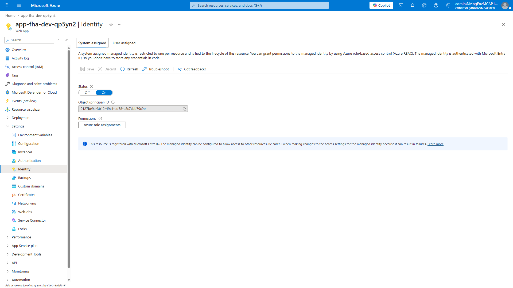

### 4. Live App Walkthrough - Four Healthcare Agents (10 minutes)

What to show:

1. Open web app homepage: https://app-fha-dev-qp5yn2.azurewebsites.net/
2. Demonstrate each agent card and one interaction per agent.
3. Navigate directly to chat routes to speed up demo:

- `https://app-fha-dev-qp5yn2.azurewebsites.net/Chat?agentId=triage`
- `https://app-fha-dev-qp5yn2.azurewebsites.net/Chat?agentId=scheduler`
- `https://app-fha-dev-qp5yn2.azurewebsites.net/Chat?agentId=medication`
- `https://app-fha-dev-qp5yn2.azurewebsites.net/Chat?agentId=faq`

What to say:

- Each agent has a role-specific system prompt and safe-response behavior.
- This demonstrates a practical multi-agent UX pattern on a single app surface.

Expected result:

- Audience sees distinct behavior by agent persona and healthcare use case.

If it fails:

- Confirm endpoint env var exists in app settings (`AZURE_OPENAI_ENDPOINT`).
- Verify OpenAI account role assignments for the app managed identity.

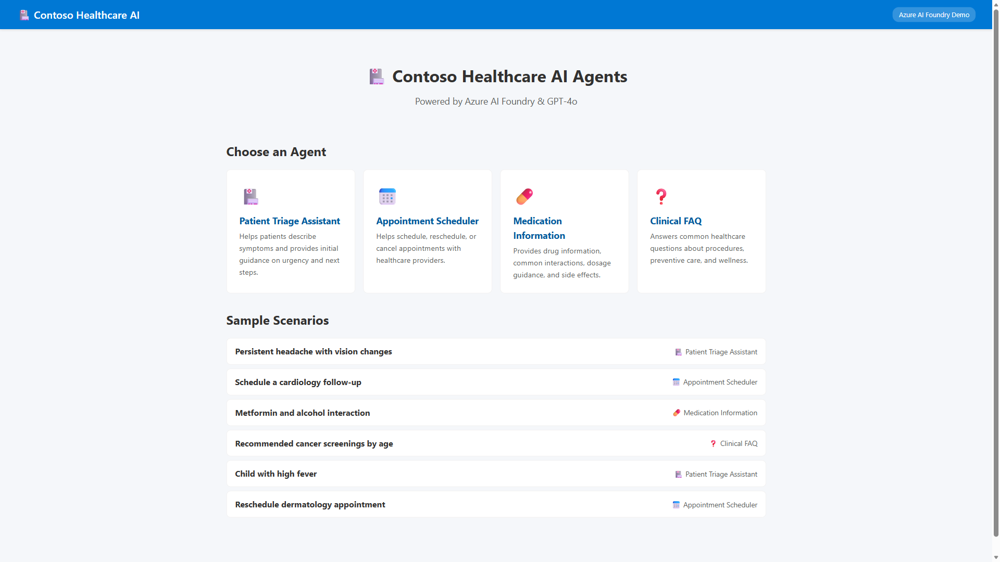
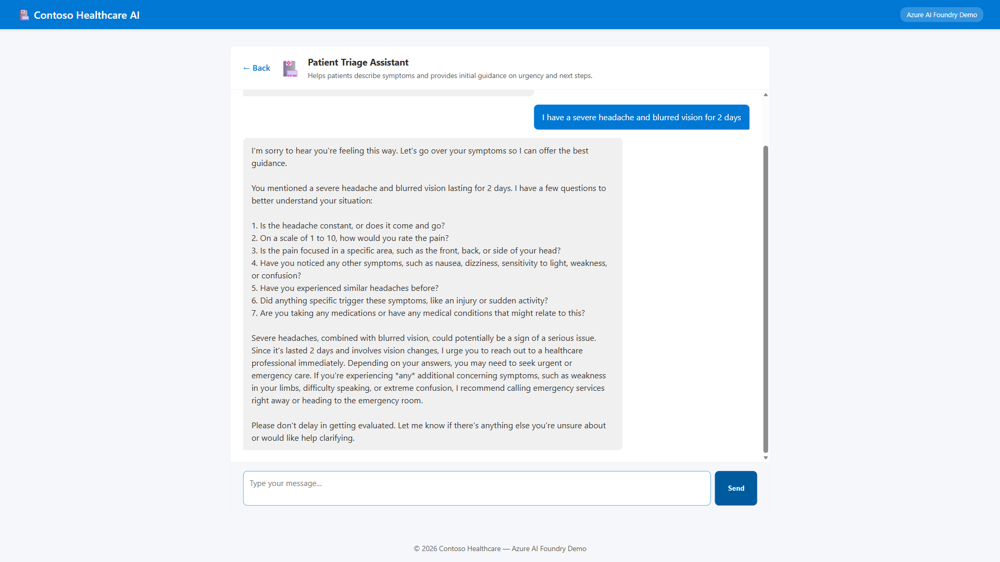
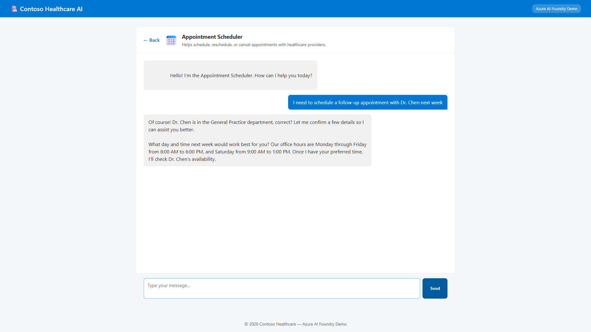
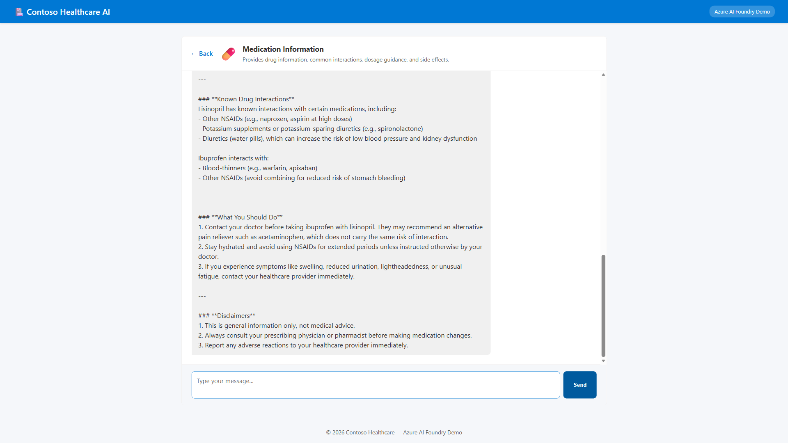
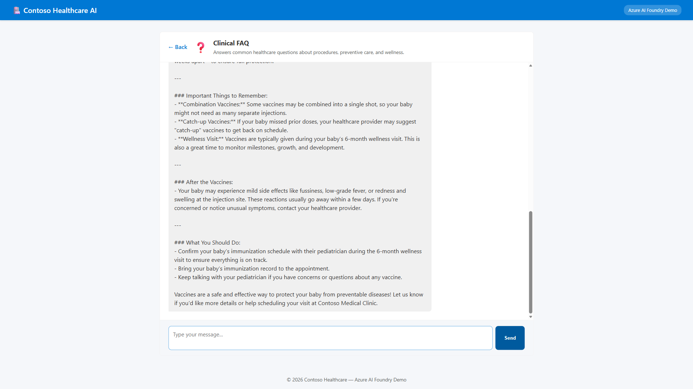

### 5. Observability and Monitoring (5 minutes)

What to show:

1. Open Application Insights `appi-fha-dev-qp5yn2`.
2. Show Live Metrics while sending one new message in the app.
3. Open Logs and run a simple request query.

```kusto
requests
| where timestamp > ago(30m)
| order by timestamp desc
| take 20
```

What to say:

- Live telemetry proves end-to-end request flow during demos.
- This is where teams validate latency, error rates, and request trends.

Expected result:

- Audience sees fresh request telemetry after live chat interaction.

If it fails:

- Check app insights connection string in App Service settings.
- Wait 1-3 minutes for telemetry ingestion.

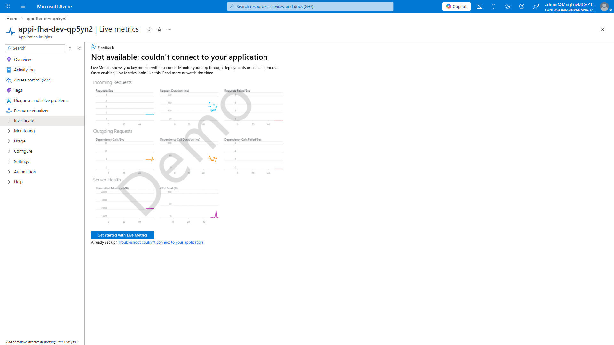
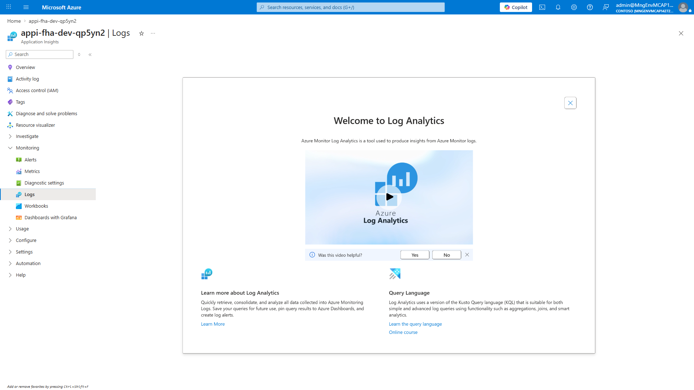

## Key Talking Points

- Azure AI Foundry Hub and Project provide clean separation of platform and workload.
- GPT-4o gives strong reasoning quality for patient-facing conversational patterns.
- Managed identity with `DefaultAzureCredential` avoids secret sprawl.
- Multi-agent architecture helps map AI behavior to business domains.
- App Insights enables measurable demo outcomes, not just a UI walkthrough.

## Sample Prompts for Compelling Responses

### Triage Agent (`agentId=triage`)

- I have had chest tightness and shortness of breath for 20 minutes. What should I do now?
- I have had a headache for three days with blurry vision this morning. Is this urgent?

### Appointment Scheduler Agent (`agentId=scheduler`)

- Book a cardiology follow-up next Wednesday after 2 PM with Dr. Patel if possible.
- Move my dermatology visit from Thursday morning to next week in the afternoon.

### Medication Info Agent (`agentId=medication`)

- I started Metformin recently. Is one glass of wine with dinner generally safe?
- Can ibuprofen interact with lisinopril, and what warning signs should I watch for?

### Clinical FAQ Agent (`agentId=faq`)

- I am 45 years old. Which cancer screenings are commonly recommended at my age?
- What preventive annual checkups should adults prioritize?

## Contingency Playbook

| Failure scenario | Quick diagnosis | Fast recovery | Skip-and-continue guidance |
| --- | --- | --- | --- |
| Web app unavailable or 5xx | `az webapp show --name app-fha-dev-qp5yn2 --resource-group rg-foundry-healthcare-agents --query state -o tsv` | `az webapp restart --name app-fha-dev-qp5yn2 --resource-group rg-foundry-healthcare-agents` | Continue with portal + Foundry + monitoring narrative |
| GPT deployment missing or failing | `az cognitiveservices account deployment list --name oai-fha-dev-qp5yn2 --resource-group rg-foundry-healthcare-agents --output table` | Re-run `azd up --no-prompt` from scenario folder | Use static screenshots and discuss model governance |
| No telemetry in App Insights | Verify app setting and run test request | Wait 1-3 minutes, refresh Live Metrics | Skip logs and focus on architecture + agent UX |

## Troubleshooting

### Azure OpenAI not configured message in chat

Cause:

- `AZURE_OPENAI_ENDPOINT` missing from app settings.

Fix:

1. Go to App Service -> Configuration.
2. Add or verify `AZURE_OPENAI_ENDPOINT=https://oai-fha-dev-qp5yn2.openai.azure.com/`.
3. Save and restart the app.

### 403 or authorization failures when calling OpenAI

Cause:

- Managed identity role assignment missing.

Fix:

1. Open `oai-fha-dev-qp5yn2` -> Access control (IAM).
2. Ensure app managed identity has an OpenAI user role assignment.
3. Wait a few minutes for RBAC propagation.

### Web app loads but responses are slow

Cause:

- Cold start, temporary platform load, or model latency.

Fix:

- Send one warm-up request before the live session.
- Keep one tab active in the app before presenting.

## Cleanup

From `generated-scenarios/foundry-healthcare-agents`:

```powershell
azd down --force --purge
```

Optional explicit resource group delete:

```powershell
az group delete --name rg-foundry-healthcare-agents --subscription 498ab842-278f-45f8-ac5c-dc89061565cd --yes --no-wait
```

## Manual Screenshot Tasks

See screenshot checklist and naming requirements in:

- `demoguide/images/README.md`

## Related Artifacts

- `../01-requirements.md`
- `../02-architecture-assessment.md`
- `../README.md`
- `../infra/main.bicep`
